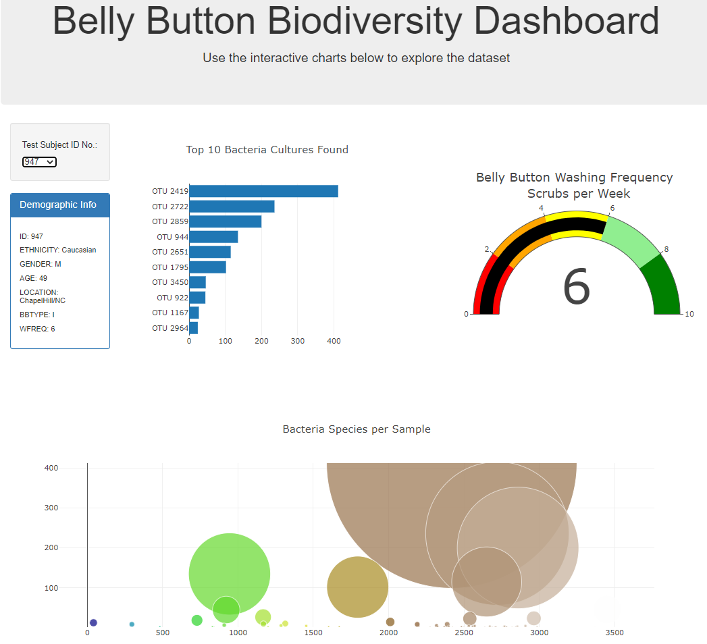

# Plotly JS

## Overview

In this project, I am tasked to help Rosa, who is a microbiological researcher. Her lab has partnered with Improbable Beef to find bacteria that can be used to create a synthetic beef substitute. Rosa believes that the ideal bacteria which can be used to make synthetic beef can be found in a person's bellybutton. To test her hypothesis, she has sampled the navels of people across the country to identify bacterial species that colonize peoples' belly buttons. The identity of everyone is kept anonymous and they are assigned an ID number. My task is to make an interactive dashbaord so that the study participants can visit the website, select their ID number, and find which bacterial species are present in their navels. 

For my analysis, I build a webpage using Javascript's Plotly library to plot data from external files and/or web-sources into bar, pie and bubble charts. I malso made use of Javascript functional programming and methods to create interactive features, such as buttons or drop down menus, build chart components and finally HTML script tags to stylize and arrange the data to publish the results. The final working webpage was published using GitHub Pages. Please click [here](https://brizvi4.github.io/plotly_JS/) to view the page. 

Publish final, working webpage using GitHub/GitPages to allow users access without the need to store the script and data in their local drives.

## Results

